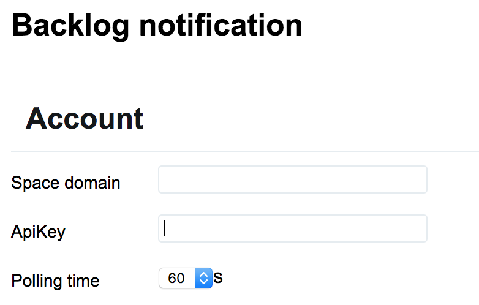

# Backlog notification

[Backlog](https://www.backlog.com/) has the function of notification though, it doesn't notify as the chrome notification.
So you and I want it to notify as chrome the notification.

This project make chrome notify to connect with Backlog and notify using chrome notification.

# How to install

Please install [crx](./backlog-notification.crx) file and drag, drop to your Chrome.

Click [here](https://github.com/1984weed/backlog-notification/raw/master/backlog-notification.crx)

# How to use 

## Space domain

You should set the domain which you always use your backlog's domain

## Api key

Yous should set your Api key

## Frequency

You should set polling time
